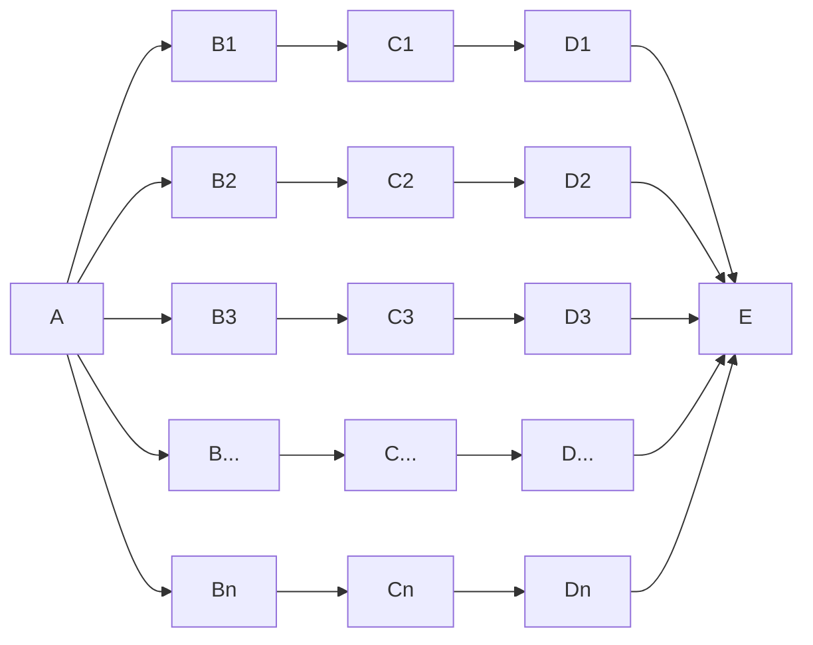

# Parallel Parameterised Pipelines

This example shows how to run a pipeline in parallel for multiple parameters.

E.g

A `pipeline.yaml` file is included to allow a single branch to be run.
The demonstration pipeline includes both Notebook and python callable tasks.

## Running 

The example can be run either for a single branch using `ploomber build`, or for the full parallel DAG with `python param_parallel.py` 

